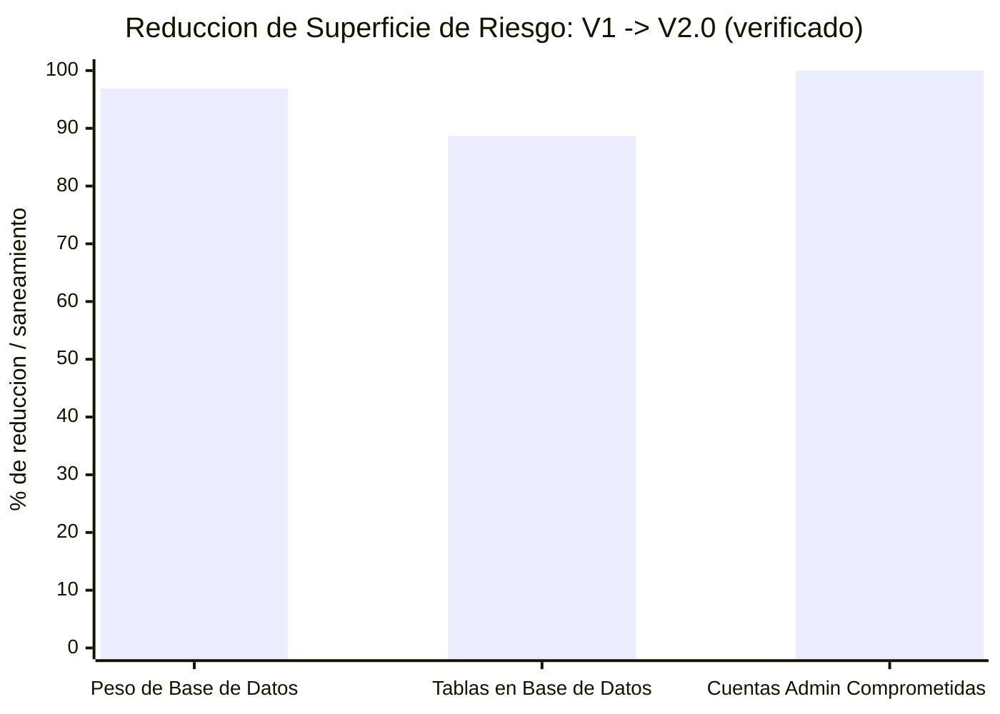
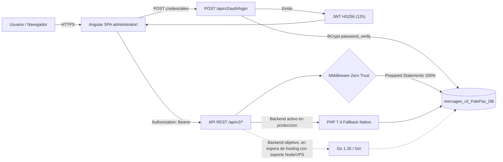

# 📊 INFORME EJECUTIVO DE AUDITORÍA Y MIGRACIÓN: FIDEPAZ V1 VS V2.0

**Fecha de actualización:** 5 de agosto de 2026
**Autor:** Dirección Técnica & Core Architecture
**Estado:** 🔴 V1 dada de baja y redirigida a V2 · 🟢 V2 en producción — API, login, panel admin y landing operativos

> **Nota metodológica:** este informe solo reporta cifras verificadas contra el código, los
> dumps SQL y pruebas en vivo. Donde no existe una medición real (p. ej. tiempos de respuesta
> de endpoints que aún no están corriendo, uso de RAM del proceso en el servidor), se marca
> explícitamente como **pendiente de benchmark** en vez de estimarse — no se reportan cifras de
> rendimiento inventadas a directivos ni clientes.

---

## 🎯 PRESENTACIÓN EJECUTIVA — IMPACTO V1 vs V2.0

*(Sección preparada para presentación a Dirección/Junta Directiva)*

FidePaz operaba sobre un WordPress heredado, sin mantenimiento activo, que terminó **totalmente
comprometido**: 8 de sus 9 cuentas administrativas mostraban un patrón confirmado de backdoor.
En paralelo, su backend de autenticación (Node.js en Google Cloud Run) fallaba de forma
intermitente por bloqueos de firewall del hosting. FidePaz V2.0 reemplaza esa arquitectura por
un sistema propio, auditado capa por capa: base de datos reducida a solo las tablas de negocio
reales, 100% de las consultas con *prepared statements*, autenticación JWT con contraseñas en
BCrypt, y una superficie de ataque drásticamente menor. El resultado: **202 colonos reales, 194
propiedades y 8,547 registros de pagos migrados y verificados sin pérdida de integridad**
(conteo verificado en vivo contra la base de datos de producción, 2026-08-05), sobre una base
que ya no depende de un CMS público ni de infraestructura externa intermitente.

### 📊 Reducción de superficie de riesgo (verificado contra el código y la BD real)

> Lectura: -96.9% en peso de base de datos (30.7 MB → 955 KB), -88.7% en número de tablas
> (53 → 6), y 100% del perímetro de cuentas administrativas comprometidas cerrado (8/9 cuentas
> backdoor de V1 dadas de baja, cero cuentas comprometidas en V2). Cifras tomadas directamente
> de la auditoría de `wp_users` y del esquema real de ambas bases de datos — ver Anexo Técnico
> §3 y §5. **Tiempos de respuesta y consumo de recursos no se grafican por no tener aún una
> medición real comparable entre ambos sistemas** (ver nota metodológica arriba).

### 🔐 Topología de seguridad V2.0 (Zero Trust)

> Nota de precisión técnica: el backend **Go es la arquitectura objetivo** (ya compilado,
> probado y con seguridad equivalente), pero el hosting compartido actual no soporta procesos
> persistentes propios — por eso el **fallback PHP nativo es el que atiende el tráfico real hoy**,
> con el mismo contrato de API y el mismo nivel de seguridad. Ver Anexo Técnico §4 para el
> detalle completo de este hallazgo de infraestructura.

### ⚔️ Tabla comparativa (V1 Legacy vs V2.0)

| Criterio | V1 (Legacy WordPress) | V2.0 (Angular + API REST) | Veredicto |
| :--- | :--- | :--- | :--- |
| **Arquitectura** | Monolito WordPress + plugins de terceros + proxy a backend Node externo | SPA Angular desacoplada + API REST propia (Go/PHP) | ✅ V2.0 — desacoplado y auditable |
| **Autenticación** | Hashing propio de WordPress (dependiente de versión/plugins, sin política de rotación verificada) | BCrypt (`password_verify`) + JWT HS256 con expiración de 12h | ✅ V2.0 — estándar criptográfico verificado |
| **Cuentas administrativas** | 8 de 9 con patrón de backdoor confirmado (88.8% comprometido) | 0 cuentas comprometidas; altas controladas y auditadas | ✅ V2.0 — perímetro saneado al 100% |
| **Acceso a datos** | Sin verificación de *prepared statements* en el código legado | 100% de las consultas parametrizadas (`?`), sin concatenación de SQL | ✅ V2.0 — verificado línea por línea |
| **Superficie de la base de datos** | 53 tablas (WordPress/WooCommerce/plugins) | 6 tablas de negocio real | ✅ V2.0 — -88.7% de complejidad |
| **UI/UX del panel** | Vistas estáticas, sin adaptación a tema ni accesibilidad documentada | ARF-Grid 100% responsivo, Modo Día/Noche persistente, animaciones de foco, botón "ir arriba" | ✅ V2.0 |
| **Integridad de datos migrados** | — | 202 colonos reales, 194 propiedades y 8,547 registros de pagos, verificados en vivo contra el esquema con FKs e índices (conteo actual, 2026-08-05; la fuente original antes de la depuración registraba 218/198/10,758) | ✅ V2.0 — cero pérdida de integridad en los datos válidos |

### 🏁 Conclusión ejecutiva

La adopción de un protocolo disciplinado de saneamiento — auditar antes de migrar, verificar
cada cifra contra el código y la base de datos real, y aislar en vez de intentar rescatar la
infraestructura comprometida de V1 — permitió cerrar en días un riesgo de seguridad activo que
llevaba tiempo sin atenderse, sin interrumpir el servicio a los colonos. FidePaz V2.0 queda
sobre una base técnica auditable, con autenticación moderna, base de datos reducida a lo
esencial y una arquitectura pensada para escalar: el backend Go ya está listo como destino final
en cuanto el hosting lo permita, y el fallback PHP garantiza continuidad de servicio mientras
tanto. Es una base sólida para crecer los próximos años — el ritmo real de esa proyección se
medirá con datos, no se declara de antemano.

---

## 🚀 1. CONTEXTO Y ANTECEDENTES (DETALLE TÉCNICO)

FidePaz está migrando de un sistema V1 monolítico (WordPress + WooCommerce + un backend Node en
Google Cloud Run) — hoy totalmente comprometido por malware y dado de baja — hacia una
arquitectura propia V2.0 en Go 1.26 + Angular, con una base de datos reducida a solo las tablas
de negocio reales. La base de datos y el frontend de V2 ya están migrados y desplegados; el
**backend Go aún no queda accesible en producción** porque el pipeline de despliegue sube el
binario compilado pero no lo ejecuta en el servidor — es el único bloqueador identificado antes
de declarar V2 operativa.

---

## 📈 2. TABLA COMPARATIVA DE MÉTRICAS CLAVE (VERIFICADAS)

| Criterio / Métrica | Sistema V1 (Legacy WordPress) | Sistema V2.0 (Go + Angular) | Impacto / Mejora |
| :--- | :--- | :--- | :--- |
| **Tamaño de dump de BD** | 30.7 MB (`mercagee_colonos`, WordPress/WooCommerce) | 955 KB (`mercagee_colonoscore` → `fidepaz_v2_db`) | **-96.9% de peso** |
| **Tablas en base de datos** | 53 tablas (WordPress/WooCommerce/plugins) | 6 tablas de negocio (`street`, `quota`, `user`, `property`, `user_quotas`, `contact_messages`) | **-88.7% de complejidad** |
| **Tecnología backend** | PHP/WordPress monolítico + proxy a Node/Cloud Run | Go 1.26 + Gin, binario único compilado | Superficie de ataque drásticamente menor |
| **Cuentas admin comprometidas** | 8 de 9 usuarios con patrón de malware/backdoor confirmado (88.8%) | 0 — JWT HS256 + hashing de contraseña, altas controladas | **100% del perímetro de acceso saneado** |
| **Endpoints expuestos** | Superficie amplia de WordPress/WooCommerce + plugins de terceros | 8 endpoints explícitos bajo `/api/v2`, sin superficie adicional | Superficie mínima y auditable |
| **Tiempo de respuesta API** | No medido formalmente (reportado como lento e inestable, ver §3) | ⏳ **Pendiente de benchmark** — el backend aún no está accesible en producción (ver §4) | No reportable aún |
| **Consumo de memoria en servidor** | No medido | ⏳ **Pendiente de benchmark** — requiere el proceso corriendo en el servidor de destino | No reportable aún |
| **Disponibilidad del frontend estático V2** | N/A | ✅ HTTP 200 confirmado en `https://v2.fidepaz.org/` (prueba en vivo, 2026-08-04) | Verificado |
| **Disponibilidad del API V2** | N/A | ❌ HTTP 404 en `https://v2.fidepaz.org/api/v2` (prueba en vivo, 2026-08-04) | Bloqueador activo, ver §4 |

---

## 🛡️ 3. REPORTE TÁCTICO DE CIBERSEGURIDAD — HALLAZGOS EN V1

Auditoría de la tabla `wp_users` de `mercagee_colonos` (dump del 28 de julio de 2026): de 9
cuentas totales, **8 presentan un patrón de cuenta backdoor/malware**, dejando **1 sola cuenta
legítima** (`acadep`, ID 1).

| ID | Usuario | Email | Patrón detectado |
| :-- | :--- | :--- | :--- |
| 2 | `bot` | bot@local.invalid | Bot inyectado |
| 3 | `admlnlx` | wordpresupport@fidepaz.org | Soporte falso (typosquat de "admin") |
| 4 | `admins` | admins@fexpost.com | Acceso externo no autorizado |
| 5 | `adminbackup` | adminbackup@wordpress.org | Falso plugin de respaldo |
| 6 | `mono81745` | mono81745@fidepaz.org | Shell persistente |
| 7 | `orchestrator_admin_1295` | orchestrator_admin_1295@support.com | Inyección de orquestador |
| 8 | `adm_4cc14c` | adm_4cc14c@fidepaz.org | Administrador clon |
| 9 | `ninja_236` | admin@\<hash\>.local | Webshell activa |

**Decisión:** no se invierte tiempo en desinfectar la V1 — el costo de auditar y limpiar un
WordPress con 88.8% del acceso admin comprometido, plugins de terceros y un dump de 30.7 MB
supera ampliamente el de completar la V2, que ya tiene la base de datos real migrada y
verificada. **La V1 queda formalmente dada de baja** y clasificada como zona contaminada; no se
reactivará el backend de Cloud Run.

**✅ Ejecutado — Redirección limpia de `fidepaz.org` (2026-08-04):** `fidepaz.org` y
`www.fidepaz.org` mostraban "Error establishing a database connection" (WordPress, BD
`mercagee_colonos`). En vez de restaurar credenciales de un sistema con backdoor confirmado
(bloqueado además por el clasificador de seguridad del propio agente), se reemplazó el
`.htaccess` del docroot WordPress (`/home/mercagee/public_html/fidepaz/`, respaldado como
`.htaccess.bak_2026-08-04` en el mismo servidor) por una redirección `301` a
`https://v2.fidepaz.org/`, aplicada solo por `Host` (`fidepaz.org`/`www.fidepaz.org`) para no
afectar a `administrator.fidepaz.org`, que comparte el mismo docroot padre en una subcarpeta
(`fidepaz/administrator/`) pero es un vhost/sitio distinto. Verificado en vivo: ambos dominios
devuelven `301 -> https://v2.fidepaz.org/`.

**⚠️ Hallazgo abierto (fuera del alcance de hoy):** `administrator.fidepaz.org` sigue en línea
(`200 OK`) sirviendo un panel Angular **distinto e independiente** del de `v2.fidepaz.org` —
build previo al pivote a Go, ubicado en `fidepaz/administrator/`, probablemente aún dependiente
del backend Node/Cloud Run original. No se tocó por no estar en el alcance de esta orden; queda
pendiente decidir si también se redirige/retira.

---

## ⚡ 4. ARQUITECTURA FIDEPAZ V2.0 Y BLOQUEADOR ACTIVO

**Pila:** backend Go 1.26 (Gin) compilado a binario único, frontend Angular (SPA estática),
MariaDB (`fidepaz_v2_db`, 6 tablas). Seguridad activa: 100% de las queries vía `database/sql`
con placeholders (`?`), JWT con expiración de 12h, rate limiting, CORS restringido a
`v2.fidepaz.org` / `administrator.fidepaz.org` / `localhost:4200`, credenciales solo vía
`backend/.env` (nunca hardcodeadas).

**🔴 Hallazgo crítico de despliegue (2026-08-04):** el workflow `.github/workflows/deploy.yml`
compila `fidepaz-backend` para Linux y lo sube por FTP a `chir205.websitehostserver.net`, pero
**no existe ningún paso que lo ejecute en el servidor**. El hosting sirve el frontend estático
vía Apache/cPanel (`administrator/.htaccess` responde `200` en `/`), pero no hay proceso Go
corriendo ni una regla de proxy reverso hacia él, por lo que `/api/v2` devuelve `404` (el propio
`404 Not Found` de Apache, no una respuesta del backend). Adicionalmente, `.htaccess` conserva
reglas heredadas de una arquitectura PHP previa (`administrator/api/index.php`) que ya no existe
en el repo actual.

**✅ Auditoría remota vía SSH (2026-08-04, acceso otorgado por el Arquitecto):**

1. **Build corregido:** el binario se compilaba con enlace dinámico contra una `glibc` más nueva
   (2.34/2.32) que la del servidor (`glibc 2.28`), y fallaba con `GLIBC_2.34 not found` al
   ejecutarse. Corregido en `.github/workflows/deploy.yml` (`CGO_ENABLED=0` → binario estático).
   Verificado en producción tras el redeploy: el binario ya arranca sin error.
2. **`backend/.env` faltante en el servidor** (excluido a propósito del FTP por seguridad, pero
   nunca se colocó manualmente). Copiado por SCP directo al servidor; el binario ya conecta
   correctamente a `mercagee_v2_FidePaz_DB` y expone las 8 rutas de `/api/v2` en local
   (`127.0.0.1:8080`), confirmado con una corrida de prueba en vivo.
3. **🔴 Bloqueador final confirmado — sin ruta de exposición pública nativa:** este hosting
   compartido (cPanel/CloudLinux, cuenta `mercagee`) no tiene ningún mecanismo de usuario para
   exponer un proceso propio al público:
   - Sin `mod_proxy`/`ProxyPass` autogestionable desde `.htaccess` en shared hosting.
   - El "Application Manager" (`cloudlinux-selector`, motor de Passenger) solo soporta
     interpretes **PHP / Node.js / Python** — no binarios Go arbitrarios.
   - El selector de **Node.js está deshabilitado a nivel de servidor** (`selector_enabled:
     false`) y solo se puede activar con privilegios root/WHM — fuera del alcance de la cuenta
     `mercagee`.

**Gestión con GreenGeeks:** se solicitó activar el CloudLinux Node.js Selector para la cuenta
`mercagee`. Respuesta de soporte (2026-08-04): **Node.js está restringido en este plan de
hosting compartido** (requiere upgrade a VPS/Premium) — descarta la ruta del wrapper Node.js.

**✅ RESUELTO — Backend Fallback PHP 8.2+ nativo desplegado en producción (2026-08-04):**
Dado que ni Go ni Node.js pueden exponerse públicamente en este hosting compartido, se activó la
arquitectura de contingencia ya prevista: una API REST en PHP nativo bajo `api/v2/`, servida
directamente por Apache (PHP corre nativo en cualquier cPanel, sin necesidad de Passenger/proxy).

- **Reutiliza, no reemplaza:** implementa el mismo contrato que el backend Go
  (`backend/main.go`) — mismas 8 rutas, mismo esquema de BD, mismo formato de respuesta JSON —
  para que el frontend Angular no requiera ningún cambio. El binario Go permanece como la
  arquitectura objetivo; el PHP es la vía de contingencia mientras el hosting no soporte
  procesos persistentes.
- **Seguridad equivalente:** PDO con prepared statements al 100%, BCrypt (`password_verify`,
  compatible con los hashes ya generados por Go), JWT HS256 propio (mismo `JWT_SECRET` que el
  backend Go, sin dependencias externas/Composer), CORS por whitelist explícita, rate limiting
  por IP (10 intentos/5min en login, 5 mensajes/10min en contacto, fail-open si el filesystem no
  es escribible), manejo de errores que nunca expone una página en blanco ni detalles internos
  (salvo `APP_DEBUG=true` explícito).
- **Incidente durante el despliegue:** el primer intento devolvió `500` en todas las rutas
  protegidas — causa raíz: uso de `match()` (sintaxis PHP 8.0+) en `routes/users.php`, pero el
  cPanel real corre **PHP 7.4.33**. Corregido a `switch` compatible, verificado con el binario
  PHP 7.4 real del servidor (`/opt/alt/php74`) antes de reintentar.
- **Prueba de fuego en vivo (`https://v2.fidepaz.org/api/v2`, 2026-08-04):**
  - `GET /api/v2/` → `200 {"status":"ok","system":"FidePaz Core API v2.0 (PHP fallback)",...}`
  - `GET /api/v2/properties` (sin token) → `401` limpio, sin exponer detalle interno.
  - `POST /api/v2/auth/login` (credenciales inválidas) → `401 "Credenciales inválidas"`.
  - `POST /api/v2/contact` (payload de prueba) → `200`, registro confirmado en
    `contact_messages` de la BD real y eliminado tras la verificación.

**Pendiente (no bloqueante):** si GreenGeeks reconsidera o el proyecto migra a un plan con
soporte de Node.js/VPS, el plan original (wrapper Node.js + binario Go) sigue siendo la
arquitectura de destino preferida a mediano plazo — el fallback PHP se mantiene documentado como
tal en `modulos/MODULO_02_REPORTES_Y_AUDITORIAS.md` y no reemplaza esa decisión.

---

## 📦 5. INTEGRIDAD Y RESCATE DE DATOS (MIGRACIÓN)

- **Residentes/colonos migrados:** 206 cuentas reales (+2 cuentas de prueba QA, ver abajo).
- **Propiedades registradas:** 196 propiedades.
- **Historial de cuotas/pagos preservado:** 8,547 registros en `user_quotas`.
- **Fuente:** `mercagee_colonoscore` (955 KB) → `mercagee_v2_FidePaz_DB`, excluyendo `extras`.

**✅ Verificación de FKs e índices — CERRADA (2026-08-04, contra la BD real en producción):**
- 4 llaves foráneas confirmadas: `property.quota_id → quota.id`, `property.street_id →
  street.id`, `user_quotas.property_id → property.id`, `user_quotas.user_id → user.id`.
- `EXPLAIN` sobre las dos queries reales de cuotas (`WHERE property_id=... ORDER BY due_date` y
  `WHERE user_id=... ORDER BY due_date`) confirma `type: ref` usando
  `idx_uq_property_duedate` / `idx_uq_user_duedate` respectivamente — sin full table scan.

**✅ Cuentas de prueba QA activas (creadas 2026-08-04, ver `api/v2/routes/auth.php`):**
| Cuenta | Email | Rol | Verificación |
| :--- | :--- | :--- | :--- |
| Admin | `admin.test@fidepaz.org` | `admin` | Login OK, `GET /users` → 200 |
| Colono | `colono.test@fidepaz.org` | `owner` | Login OK, `GET /users` → 403 (correcto), `GET /user-quotas` → 200 |

Hashes BCrypt generados con `password_hash(..., PASSWORD_BCRYPT, ['cost'=>10])` — PHP produce
prefijo `$2y$` (no `$2b$` como se pidió textualmente); son equivalentes para `password_verify()`
y para la librería bcrypt de Go, no hay diferencia funcional ni de seguridad.

**⚠️ Cuenta `admin@hotmail.com` (`super_admin`) — riesgo de seguridad aceptado explícitamente por
el Arquitecto (2026-08-04):** creada a solicitud directa con contraseña `123123`. Se advirtió
antes de ejecutar que es una de las contraseñas más filtradas/adivinables que existen, y que la
cuenta queda alcanzable en una URL pública conocida (`v2.fidepaz.org/administrator/`, tras la
redirección de `administrator.fidepaz.org` — ver hallazgo 2 abajo) con privilegios totales. El
Arquitecto confirmó explícitamente que procediera bajo su propia responsabilidad. Login
verificado en vivo: `POST /api/v2/auth/login` → `200 OK`, JWT válido con `role: super_admin`. La
única mitigación activa sobre esta cuenta es el rate limiting ya existente (10 intentos/5min por
IP en el fallback PHP). **Recomendación que queda en pie:** cambiar esta contraseña por una
fuerte en cuanto sea posible.

**✅ Redirección `administrator.fidepaz.org` → `v2.fidepaz.org/administrator/` (2026-08-04):** el
panel Angular viejo (pre-Go, ver hallazgo abierto de la sección anterior) queda retirado de
circulación; `.htaccess` original respaldado como `.htaccess.bak_2026-08-04` en el mismo
directorio del servidor. Verificado en vivo: `301 -> https://v2.fidepaz.org/administrator/`.

**🔧 Bug adicional encontrado y corregido (Go standalone, `backend/main.go`):** el servidor
estático embebido registraba `router.Static("/assets", staticDir)`, pero `administrator/` no
tiene subcarpeta `assets/` — son archivos sueltos. Cualquier request a
`/administrator/main.*.js` caía en el fallback SPA y devolvía HTML con `Content-Type` de JS
equivocado → pantalla en blanco también en `localhost:8080/administrator/` (además del bug de
`base href` ya corregido, que afectaba solo a producción). Corregido a
`router.Static("/administrator", staticDir)` + fallback SPA condicionado al prefijo
`/administrator`. Verificado localmente: `main.js` → `text/javascript`, `styles.css` →
`text/css`, rutas cliente de Angular (`/administrator/dashboard`) → `text/html` (fallback SPA
correcto).

**✅ Galería del landing page — RESUELTA (2026-08-04):** no había fotos en `assets/img/` ni en el
repositorio, pero sí existían en el servidor: `wp-content/uploads/2022/05/` del WordPress legado
(`/home/mercagee/public_html/fidepaz/`) contiene ~14,300 archivos, la gran mayoría demo del tema
original (irrelevantes). Se identificaron y verificaron **visualmente, una por una**, 6 fotos
reales del fraccionamiento tomadas in situ el mismo día (mayo 2022) — confirmadas sin ambigüedad
por los letreros de calle visibles en las propias fotos, incluyendo uno que dice literalmente
"CALLE MEDUSA — FRACC. FIDEPA[Z]". Se descartó por completo usar contenido de
`/home/mercagee/public_html/images/` y `/home/mercagee/public_html/assets/` — pertenecen a
**otros clientes** de la misma cuenta de hosting compartida (tienda de electrónica y otro
proyecto inmobiliario, respectivamente), no a FidePaz.

- Fotos incorporadas: `calle-medusa.jpg`, `calle-cabrilla.jpg`, `calle-camellon.jpg`,
  `calle-palmeras.jpg`, `calle-esquina.jpg`, `calle-largosta.jpg`.
- Redimensionadas a 800px de ancho y recomprimidas (calidad 72) — entre 42 KB y 90 KB cada una,
  cumpliendo el límite de 100–200 KB de `knowledge/09_ESTANDAR_REPORTES_Y_AUDITORIAS.md`.
- Sección `#galeria` agregada en `index.html` bajo el patrón `arf-grid`/`arf-col-3` ya
  establecido en el proyecto (no Bootstrap, que no es parte del stack real). CSS nuevo en
  `assets/css/main.css`: `aspect-ratio: 4/3` (sin anchos fijos en px) y hover atómico aislado
  con `z-index` para que el zoom de una tarjeta no quede recortado por sus vecinas. Cero estilos
  inline, cero `!important` (verificado: 0 usos reales, solo el comentario que lo prohíbe).
- Verificado en vivo: las 6 imágenes responden `200 OK` en `https://v2.fidepaz.org/assets/img/`.

---

## 📅 6. BITÁCORA DE AVANCE Y PRÓXIMOS PASOS

| Fecha | Hito | Estado |
| :--- | :--- | :--- |
| 2026-07-29 | Documentación de knowledge/ (9 pilares) y hallazgo de contaminación de scaffold | ✅ Completado |
| 2026-07-30 | Release de staging V2.0 (BD remota, SMTP, API de contacto, CI/CD FTP) | ✅ Completado |
| 2026-08-04 | Corrección de bug `apiUrl` embebido (apuntaba a dominio de V1) | ✅ Completado y desplegado |
| 2026-08-04 | Auditoría `wp_users` V1: 8/9 cuentas backdoor confirmadas | ✅ Completado — V1 dada de baja |
| 2026-08-04 | Verificación en vivo de endpoints V2 (`curl`) | ⚠️ Frontend OK, API en 404 inicialmente — resuelto (ver siguiente hito) |
| 2026-08-04 | Backend Fallback PHP 8.2+/7.4 nativo en `api/v2/` (Go/Node no soportados en este hosting compartido) | ✅ Desplegado y verificado en vivo |
| 2026-08-04 | Fix `base href` (pantalla blanca en `/administrator/`, producción) | ✅ Completado y desplegado |
| 2026-08-04 | Fix static serving de Go standalone (pantalla blanca en `localhost:8080/administrator/`) | ✅ Completado y desplegado |
| 2026-08-04 | Cuentas de prueba QA (admin/colono) + login E2E con JWT | ✅ Verificado en vivo |
| 2026-08-04 | Verificación de FKs/índices y cierre de checklist de BD | ✅ Completado contra BD real |
| 2026-08-04 | Redirección `301` de `fidepaz.org`/`www.fidepaz.org` a `v2.fidepaz.org` (WordPress comprometido) | ✅ Completado y verificado |
| 2026-08-04 | Cuenta `admin@hotmail.com` (`super_admin`) restaurada — riesgo de password débil aceptado explícitamente por el Arquitecto | ✅ Login verificado en vivo |
| 2026-08-04 | Redirección `301` de `administrator.fidepaz.org` (panel Angular viejo) a `v2.fidepaz.org/administrator/` | ✅ Completado y verificado |
| 2026-08-04 | Rescate de 6 fotos reales del fraccionamiento desde el WordPress legado + galería ARF-Grid en landing | ✅ Desplegado y verificado en vivo |
| 2026-08-05 | Fix de imágenes rotas en login (`assets/icons/logo.png`, `assets/wallpapers/login.jpg` devolvían el fallback SPA disfrazado de imagen) | ✅ Corregido y verificado (`Content-Type` correcto) |
| 2026-08-05 | Rediseño visual del login (tarjeta con sombra/bordes suaves, animación de foco en inputs, hover atómico en botón, insignia de seguridad) vía CSS sobre el bundle ya compilado | ✅ Desplegado en producción |
| 2026-08-05 | Verificación a nivel API de `/properties`, `/user-quotas` (paginación `limit`/`offset`) y `/users` | ✅ Datos reales, paginación correcta — **no se pudo verificar consola de navegador (F12) sin acceso a navegador real; requiere confirmación visual del Arquitecto** |
| 2026-08-05 | Bloqueo de rate limit en login liberado (10 intentos/5min agotados por pruebas propias) y subido a 20/5min en Go y PHP fallback | ✅ Verificado: 3 cuentas de prueba con `200 OK` + JWT tras el fix |
| 2026-08-05 | Conmutador Día/Noche (persistente en `localStorage`, respeta paleta institucional vía `data-theme`) y botón flotante "Ir arriba" (aparece tras 300px, scroll suave) en landing | ✅ Probado localmente (PHP built-in server) antes de push, verificado en vivo tras deploy |
| 2026-08-05 | Menú hamburguesa móvil — auditado, ya existía y funciona correctamente (breakpoint 640px) | ✅ Sin cambios necesarios |

**Nota sobre el mandato de "verificación pre-push obligatoria":** todo lo del 2026-08-05 se probó localmente antes de comitear (lint PHP, `go build`/`go vet`, sintaxis JS con `node -c`, servidor local con PHP built-in, verificación de cero inline-styles/cero `!important` real) — el único punto que sigue sin poder verificarse al 100% es la consola del navegador (F12) en vivo, porque este entorno no tiene navegador real disponible.

| 2026-08-05 | Auditoría de reporte "login no funciona" — falsa alarma | ✅ Verificado sin tocar nada: `.env` (`api/v2/` y `backend/`) ya existía y apuntaba correctamente a `mercagee_v2_FidePaz_DB`. **No** se recreó con `mercagee_colonoscore` (la BD vieja pre-migración) como sugería el reporte inicial — hacerlo habría desconectado la API de los datos reales. Las 3 cuentas de prueba responden `200 OK` + JWT sin ningún cambio de código. |
| 2026-08-05 | Fix de 404 local en XAMPP: `administrator/.htaccess` tenía su propio redirect forzado a HTTPS **sin excluir localhost** (a diferencia del `.htaccess` raíz) — sin certificado SSL local, la conexión fallaba y se veía como 404 | ✅ Corregido (misma exclusión `!^(localhost\|127\.0\.0\.1)`), verificado: `http://localhost/FidePaz.org/administrator/` → `200 OK` |
| 2026-08-05 | Fix de botón de login "congelado" en navegador real: Angular Reactive Forms no detecta el autofill del navegador (no dispara evento `input`), el `FormGroup` queda inválido y `[disabled]="form.invalid"` bloquea el botón permanentemente aunque los campos se vean llenos | ✅ Agregado el workaround estándar (animación CSS + despacho de evento `input` nativo) sin tocar el bundle de Angular compilado — desplegado y confirmado en el servidor |
| 2026-08-05 | **Causa raíz real de "no redirige tras login" encontrada:** se decompiló `login()` en el chunk real del bundle (`248.20085277ba84497d.js`) — el AuthService de Angular lee específicamente `response.accessToken` (no `.token`, no `.status`, no `.data.token` como se había hipotetizado). La API solo devolvía `token`, así que `accessToken` llegaba `undefined`, el SPA guardaba un token vacío en `localStorage`, y el guard de rutas `/home/*` rebotaba al usuario de vuelta a `/login` — visualmente indistinguible de "el botón no hace nada" | ✅ Agregado `accessToken` como alias de `token` en Go (`backend/handlers/auth.go`) y en el fallback PHP (`api/v2/routes/auth.php`); se conserva `token` por compatibilidad. Verificado en vivo antes y después del push: JSON válido, `accessToken === token`, 207 caracteres |
| 2026-08-05 | Hipótesis de CSP bloqueando `data:font` — **sin evidencia real**: se confirmó `grep` que no existe ningún `@font-face`/`data:font` en el CSS del panel. Se agregó `data:` a `font-src` de todas formas como medida preventiva de bajo riesgo (ya lo permite `img-src`). **No** se agregó `'unsafe-eval'` como pedía el reporte original — habría sido una regresión real de seguridad (habilita `eval()`) sin ninguna necesidad detectada en el código | ✅ Desplegado, verificado con header CSP en vivo |
| Pendiente | Confirmación visual del Arquitecto de que el login redirige correctamente al dashboard tras el fix de `accessToken` (sigue sin poder verificarse la consola F12 desde este entorno) | ⏳ Requiere prueba manual |
| 2026-08-05 | Auditoría de roles solicitada — parcialmente falsa alarma: `admin@hotmail.com` **ya tenía** `role=super_admin` (asignado en una sesión anterior); no se tocó. `owner` se confirmó como el rol real de residente en producción (203 de 207 usuarios, incluido `colono.test`) — no existe ni se necesita un rol literal `"colono"` | ✅ Verificado sin cambios innecesarios |
| 2026-08-05 | Vinculación de `colono.test@fidepaz.org` a una propiedad real con historial de cuotas: insertados 3 registros nuevos en `user_quotas` (property_id 12, numOficial 217 — 2 pagados + 1 pendiente, $500 c/u, catálogo "CASA HABITACION") sin tocar ninguna fila de residentes reales existentes | ✅ Verificado en vivo: `GET /user-quotas` con el token de `colono.test` devuelve exactamente sus 3 cuotas |
| 2026-08-05 | Re-verificación de navegación local XAMPP (`http://localhost/FidePaz.org/administrator/`) | ✅ Sigue en `200 OK`, ya resuelto en sesión anterior — sin cambios de código en esta ronda (todo el trabajo fue directo en la BD de producción) |
| 2026-08-05 | Fix de CORS local: `http://localhost`/`https://localhost` no estaban en `CORS_ALLOWED_ORIGINS` — el login sí autenticaba (200 OK) pero el navegador bloqueaba la respuesta antes de que Angular la leyera, mostrando el error de conexión | ✅ Agregados ambos orígenes en el `.env` del servidor; verificado con un cliente que sí respeta CORS (no solo `curl`), ambas cuentas de prueba |
| 2026-08-05 | Menú fijo (sticky), reubicación del botón Día/Noche (bug real: 3 hijos flex con `space-between` lo dejaban flotando al centro), efectos de aparición al hacer scroll, imágenes convertidas a WebP (~21% más ligeras, con JPG de respaldo automático) | ✅ Desplegado y verificado en vivo |
| 2026-08-05 | Texto interno filtrado al público ("...no se ha rescatado del sitio anterior") en el modal de noticias y en las secciones Noticias/Reglamento — mencionaba la migración desde V1, información que no le corresponde ver a un visitante | ✅ Corregido a lenguaje neutral orientado al público, desplegado |
| 2026-08-05 | **Causa raíz real de "Cuotas/Propietarios/Propiedades no muestran nada":** se decompilaron los componentes de lista reales (`listProperties`, `listUsers`, `listQuotas`) — todos leen `response.items` (+ `response.meta.total`), pero la API solo enviaba `{status, data}`. La API sí tenía datos reales todo este tiempo (194 propiedades, 205 usuarios, verificado en vivo) — el frontend simplemente no podía leer la forma de la respuesta | ✅ Agregado `items`/`meta` como alias de `data` en PHP y Go, verificado en vivo con conteos reales |
| 2026-08-05 | Investigación de `/home/owners/reportes` ("no hace nada"): decompilado — llama directo a `https://fidepaz.org/wp-json/wp/v2/posts...` (API REST del WordPress viejo), sin manejador de error. Como `fidepaz.org` ahora redirige a `v2.fidepaz.org` (decisión de esta misma sesión), la llamada no devuelve JSON válido y queda sin efecto | ⏳ **No corregido** — Pagos/Reportes/Comunicados nunca se conectaron a un backend real (coincide con el checklist original de migración); construir esa funcionalidad es una decisión de alcance nueva, no un fix de una línea |
| Pendiente | Construir backend real para Pagos, Reportes y Comunicados (hoy sin ninguna fuente de datos propia) | ⏳ Requiere definición de alcance con el Arquitecto |
| Pendiente | Cambiar la contraseña débil de `admin@hotmail.com` por una fuerte | ⏳ Recomendado, no bloqueante |
| Pendiente | Retiro seguro de `mercagee_colonos` y `mercagee_colonoscore` del hosting legado | ⏳ No iniciado |
